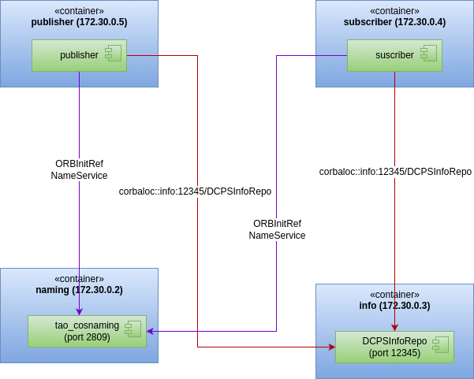

# Messenger example

**Build instructions**

1. Build IDL files:

~~~bash
./generate_dds_types.sh idl generated
~~~

2. Build with CMake:

~~~bash
mkdir build
cd build
cmake ..
make
~~~

**Execution instructions**

Three terminals are needed:

1. Terminal 1 - Run IOR

~~~bash
./run.sh # Start docker
cd examples/messenger/build
DCPSInfoRepo -o simple.ior
~~~

2. Terminal 2 - Subscriber

~~~bash
./run.sh # Start docker
cd examples/messenger/build
./subscriber -DCPSInfoRepo file://simple.ior
~~~

2. Terminal 3 - Publisher

~~~bash
./run.sh # Start docker
cd examples/messenger/build
./publisher -DCPSInfoRepo file://simple.ior
~~~